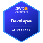

Hello!

My name is <b><>Edgar</b><> 

& I am passionate about <b><>Software development</b><>🖥️

## Skills
<b><i>Programming Languages: </i></b>
Java, JavaScript.  

<b><i>Web Technologies: </i></b> 
Typescript, HTML5, CSS3, Node.js, React.js, Spring, Express.js.  

<b><i>Databases: </i></b> 
MySQL, MongoDB, PostgreSQL.  

<b><i>DevOps: </i></b> 
Linux, Docker, git, Terraform, Ansible, Cloudwatch, Jenkins, Bash, AWS.  

<b><i>Processes: </i></b>
Agile, Scrum.  

<b><i>AWS Certifications:</i></b>

## GitHub stats

## Projects I'm currently working on
&nbsp;&nbsp;&nbsp;&nbsp;👨‍💻 Developing a web app for robot management, including remote control, diagnostics, event tracking, and real-time video streaming. 
&nbsp;&nbsp;&nbsp;&nbsp;📱 Enhancing a fitness Android app with support for additional sensor data and performance tracking. 
&nbsp;&nbsp;&nbsp;&nbsp;🔧 Automating CI/CD pipelines across projects — handling tasks like dependency installation, linting, unit & E2E testing, and deployment workflows.  

## My hobbies
&nbsp;&nbsp;&nbsp;&nbsp;⚽ Playing Football, biking and swimming.

&nbsp;&nbsp;&nbsp;&nbsp;📖 Nature, gym and travelling.

## I am looking for
&nbsp;&nbsp;&nbsp;&nbsp;🏢 Software engineer opportunities. Feel free to [contact me](https://www.linkedin.com/in/edgar-rosende-764aa978) through Linkedin to discuss! 

<!--

Here are some ideas to get you started:

- 🔭 I’m currently working on ...
- 🌱 I’m currently learning ...
- 👯 I’m looking to collaborate on ...
- 🤔 I’m looking for help with ...
- 💬 Ask me about ...
- 📫 How to reach me: ...
- 😄 Pronouns: ...
- ⚡ Fun fact: ...
-->
